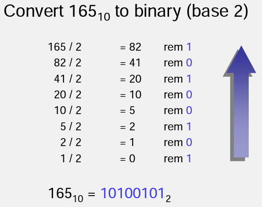
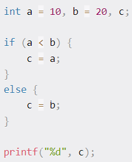
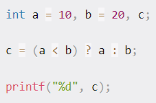

# Lecture 2

## Contents
1. Information Representation ![Information Representation]
2. Design and development
3. Control Flows

## Information Representation

There are 2 types of information representatoin
    - External representation
      - is the way information is represented by humans
    - Internal representation

### External Represntation
Computers use decimals digits, sign/magnituede notation and the alphabet. Virtually all computers store data, numbers, letters, graphics using binary numbering

### Why Binary is used?
* electronics bi-stable environment,
    - on/off,, high/low voltage, 
    - bit : these can represent 0/1
*  reliability
    - using only 2 values they can easily be differentiated. 

### Number Systems
* Base 10 - Decimal - Denary
* Base 2 - Binary - Bin
* Base 16 - Hexadecimal - Hix

### Hexadecimal

* 16 Symbols
    - {0,1,2,3,4,5,6,7,8,9,A(=10),B(=11),C(=12),D(=13),E(=14),F(=15)}

  initializing variable as hex
    -int hexNumber = 0x1A;

## Design and developmet

Start with program Spec/requirements
Using 4 steps:
1. Analyse the problem
2. Develop a solution
   - Use/design and algorithem
3. Code the Solution
   - Write the Program
4. Test and Correct the Program 

### 1. Analyse the Problem

Determine and understand the output items the program must peoduce. 

Determine the input items.

Determin the problems Input/output (I/O).
Once the I/O is determined, then specific stemps can be used to transform the inputs into outputs.

### 2. Develop a Solution

This step is to select the exact set of steps to transform inputs into outputs, Algorithm.
Potentially using psuedocode to figure out a solution, a formula or a flow chart. 

### 3. Code the Solution

Transfering logic into code

### 4. Test and Correct the Program

The purpose of testing is to verify that the program works correctly and fulfills its requirements. 

## Control flows

There are four types of control

### Sequence Control

### Decision Control

### Case Control

### Loop Control

ternary operator is ("?") This evaluates the condition and prints the result

