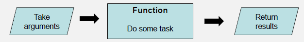
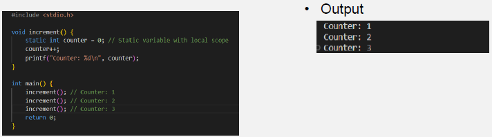

# Lecture 3

## Arrays and Strings

### Arrays

Arrays are a collection of similar data types.
This is a convenient way to store multiple values of the same data type under a single identifier.

Declaration Example:
 > datatype arrayName[arraySize];
 <br>
 int numbers[5];

Multiple arrays can be defiined in one line as long as they are of the same type.

> int b[100], x[23];

Arrays do not need to be initialized at declaration. If not defined then random values are assigned to array. 
To initialize the array curly brackets are used. Additionally, the size of the array can be omitted and determined when initialized.
> int numbers[5] = {2,3,4,5,6};

### Strings

A string is a one dimensional array of characters. The string needs to be terminated by a null, which is '\0'. This appears at the end of every string which means the array size is always one character longer.

> char string1[] = "hello";
<br>
// The code below is how the string is stored.<br>
 char string1[] = {'h','e','l','l','o','\0'};

## Functions

### Random Numbers

The **rand** function is used in c to generate a random number between 0 and 32767. The number generated isn't random can be regenerated again consistently, this only initializes a random number once.

The **rand** funciton is defined as:
```
int rand(void)
// There is an integer output but 0 input

int randomNumber = rand();
randomNumber = rand()% 100;

// The modulus allows us to limit the random number up to 100, not including
```

The **srand** function allows a specific seed to be chosen for the random number generation equation. This randomises the value so that a new value can be generated on each time the code is ran. 

The **srand** funciton is defined as:
```
void srand(int seed)
// There is 1 input and 0 output.
```
It is common practise to use the time as the seed for **srand**.

Sample code:
```
#include <stdio.h>
#include <stdlib.h>
#include <time.h>

int main()
{
    int rand_num = 0;

    //Seed the random number generator
    srand(time(NULL));

    for(int i = 0; i < 5; i++)
    {
        rand_num = rand() % 50;
        printf("%d\n", rand_num);    
    }
    return 0;
}
```
### Functions
A function is a block of code that performs a particular task. It can be used multiple times and increases code reusability.




Functions can be viewed as "sub-program" which:
* Does a specific task
* Improve code organization
* Enhance code readability
  
There are 2 main types of functions, Library and User-defined fucntions.

To use functions there are 3 main aspects:
* **Prototype** - function header/defining the function
* **Implementation** - the body of the function/implementing the function
* **Function Calling** - using the function

There are two ways of declaring a function. The function must be __declared__ before being called, however the function does not need to be defined before the main.

Example:
```
#include <stdio.h>

int newFunction1(); // This is declaring the function

int newFunction2(int var){
    //Define Function
}// This is declaring and defining a function.  This function will work

int main(){
 //Code
}

int newFunction1(){
    //Define function
} This function will now run as it has been declared above and defined here.

int newFunction3(){
    // This function will not run, as the declaration is after the main function.
}
```

### Recursion

This is when a function calls itself to solve a smaller instance of the same problem. This breaks down a problem into simpler subproblems.
Common examples of recursion are factorials or powers.

```
Recursion
unsigned long factorial(int n){
    if(n == 0 || n == 1){
        return 1; 
        // Base case: factorial of 0 and 1 is 1
    }else{
        return n*factorial(n-1);
        // Recursive case: n! = n * (n - 1)!
    }
}

Loops and fuction
unsigned long factorial(int value){
    long result = 1;
    int count;

    for (count = 2;count <= value; count++){
        result = result * count;
    }
    return result;
}
```

### Basics of Recursion

There must be a termination condition to prevent infinite recursion.
There should be a __Base Case__ which represents the simplest form of the problem.
Iteration and recursion are almost interchangable. If a solution involves iteration then a solution using recursion can be created.

### Variable Scope

Scope referes to the region where a variable/identifier is valid.

1. Local Scope (function/block scope)
   * Variables declared within a function or a block of code
   * Only accessible within the specific function or block
   * Once the code using the variable is executed the variables ceases to exist
2. Global Scope
   * Variables declared outside of any function or block
   * These variables are accessible from any part of the program
   * Conventionally defined at the top of the program and persist throughout the program
3. File Scope (Static variables)
   * Variables declared as static at the global level
   * Static has 2 meanings
     * Outside a function, then static variables/functions are only visible within the file not globally
     * Inside a fucntion, then the variable is local to the function and is only initialized when compling and do not reinitialize with each function call
   * Static variables are allocated memory when the program starts and retains their values between function calls and across scopes within a single source file.
    
4. Function Parameters
   * Variables declared in teh parameter list of a function
   * These act like local variables but are not initialized in the function, but rather intialized when called
  
