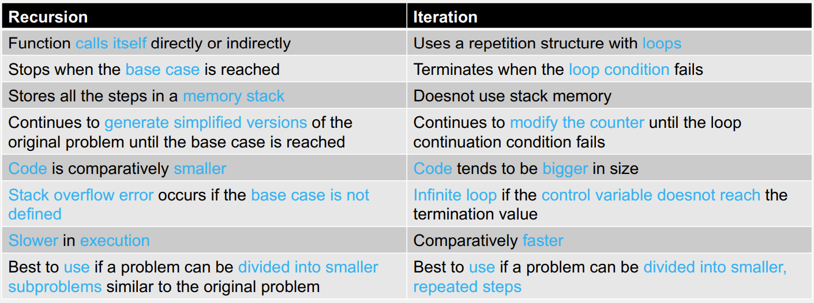
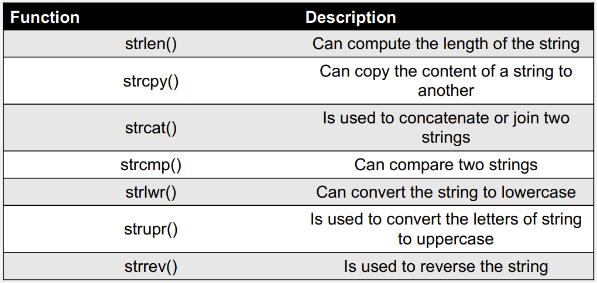

# Arrays and Pointers

## Recursion vs Iteration

|Recursion | Iteration|
|------| -----|
|Function calls itself directly or indirectly| Uses a repetition structure with loops|
|Stops when the base case is reaced| Terminates when the loop condition fails|
|Stores all the steps in a memory stack|Does not use stack memory|
|Continues to generate simplified versions of the original problem until the base case is reached|Continues to modify the counter until the loop continuation condition fails|
|Code is comparatively smaller|Code tends to be bigger in size|
|Stack overflow error occurs if the base case is not defined|Infinite loop if the control variable does not reach the termination value|
|Slower in execution|Comparatively faster|
|Best to use if a problem can be divided into smaller subproblems similar to the original problem|Best to use if a problem can be divided into smaller repeated steps|

## Arrays
### String Handling

### Multi-dimensional Arrays

Example:
~~~
float x[2][4];
~~~
The array is formatted as seen below
| | Column 1|Column 2|Column 3|Column 4|
|----|---|-----|-----|----|
|Row 1| [0][0] |[0][1]|[0][2]|[0][3]|
|Row 2| [1][0] |[1][1]|[1][2]|[1][3]|

To find size of array, use sizeof() however this returns the amount of storage needed to store the array, therefore to find the size we need to divide the size of whole array by a single elemnt.
~~~
int size = sizeof(week)/sizeof(week[0]);
~~~

Nested loops are slow. If multiple loops are needed then it is easier to use the same loop for each 'action'.

### Passing arrays to functions
To pass an array into a function the array variable name and array size is specified

example:
~~~
functionName(ArrayName, ArraySize){}
~~~

## Analysis of Algorithms

This is the study of the efficienty of algorithms. 

The worse case is taken as the algorithm time.

### Sequential Search

Finds a target in a list of array.
The algorithm finds the target by comparing each element in the list.

|Element| 0| 1| 2| 3| 4| 5| 6| 7|
|--|--|--|--|--|--|--|--|--|
|Value| 76| 34| 235| 66| 430| 373| 23| 64| 120|

Searches each element

### Binary Search
Requires the list to be ordered. Then splits the list into halfs and check if element is higher or lower than the min element in the higher array, or the max element in the lower array.

Binary search is more efficient then the sequential search. Sequential search the worse case will take 100 turns in the guess the number game.
Whereas binary the worse case will take 
$$log_2(100)$$

## Pointers