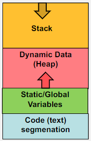
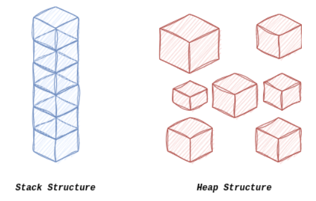

# Dynamic Memory Allocation

## Pointers and arrays
Accessing arrays using pointers
~~~
*(B+i) = B[i]
*(*(B+i)+j) = B[i][j]
*(*(*(B+i)+j)+k) = B[i][j][k]
~~~

## Static Memory Allocation

This is **memory allocated** during the compile time. This is **fixed** and cannot be changed in the run time.
This causes issues as this **wastes** memory if values stored uses less memory, and if **more** memory is needed then this can crash the program or create strange behaviours.

## Dynamic Memory Allocation

 This allocates memory at the time of execution (run time).

Main benefits of DMA is with *limited* static memory, using DMA allows for more efficient use of memory resources and avoides memory fragmentation.

### Stack Vs Heap
 

Memory is an **ordered** list of locatiosn with unique addresses to store data.

#### Stack

Regular Variables are stored on the stack

- As more memory is needed for variables the data is *stacked* in **order** right next to the  memory for existing variables.

A stack is memory that is allocated to store data of functions when called, once the function ends this memory is then freed up to be reused. The memory is allocated in a orderly fashion which makes using stacks fast and automatic.

Note: a recursion function creates new stacks for each call of the function.

Stack memory Definintions

StackOverflow
>The stack is the memory set aside as scratch space for a thread of execution. When a function is called, a block is reserved on the top of the stack for local variables and some bookkeeping data. When that function returns, the block becomes unused and can be used the next time a function is called. The stack is always reserved in a LIFO (last in first out) order; the most recently reserved block is always the next block to be freed. This makes it really simple to keep track of the stack; freeing a block from the stack is nothing more than adjusting one pointer. - [StackOverFlow Question](https://stackoverflow.com/a/80113)

Baeldung.com
> 
>In programming, whenever a function is called, the program generates a new stack memory block for the function to utilize. This type of memory is located in the stack section of a program’s memory space, which is a reserved restricted memory area. This section is usually located at the top of the memory space and grows downward as more data is added.
> 
>**Stack memory employs an automatic allocation and deallocation of memory that stores temporary data created by functions or procedures.** Stack memory uses a “Last In, First Out” (LIFO) data structure, meaning that the most recently added item is the first to be removed. When the function or procedure is finished executing, the stack memory block is released automatically, and the program returns to the previous point of execution.
> 
>Stack memory is useful in managing memory usage as it avoids memory leaks due to its architecture. Moreover, the stack may overflow and crash in the case of many nested function calls. - [Baeldung.com](https://www.baeldung.com/cs/memory-stack-vs-heap)

### Heap

Heap memory is used for DMA which is managed manually. This is useful to store data structres with unknown size. This is more flexible than stack and is adjustable during the runtime. However this can lead to issues such as memory leaks.

Baeldung.com
>**Compared to stack memory, heap memory operates dynamically, which basically means that the program can allocate and deallocate memory areas of different sizes when necessary.** This allocation/deallocation of memory depends on the requirements that arise during runtime.
>
>A program’s memory space consists of a heap section, which is reserved only for a program’s heap memory. The size of the heap partition is not fixed and can be dynamically adjusted at runtime.
>
>In addition, heap memory is not associated with a specific function or process. **The data in heap memory is not arranged in any specific pattern and can be reached in any order.** Throughout a program’s runtime, only useful areas of memory are retained in heap memory.
>
>Consequently, heap memory is suitable for dealing with large, complex data structures such as tables, linked lists, and trees and facilitates memory sharing between different program parts.
>
>Although, occasionally, heap memory may be more challenging and lead to memory leaks or other memory-related errors.

## Pointers and DMA

Pointers play an important role in DMA. Allocated memory can only be accessed via pointers. 

There are 4 functions that is used for DMA in the \<stdlib.h\>:
1.  malloc()
2.  calloc()
3.  realloc()
4.  free()

