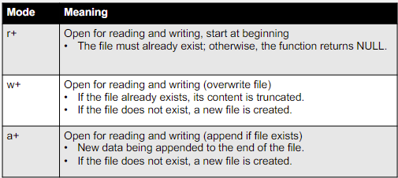

# File Handling in C

## Files in C
Temporary data like variables are lost when system is shut off. 
Files retain this information permanently.

File handling is provided in \<stdio.h\>

## Types of files
### Text Files
Text files with information/data that is easily read by humans.

*.txt, *.doc, *.ppt, *.cpp, *.c, *.h

### Binary Files
Binary fiels can't be read or modified by humans. These files contain non textual data in binary format.

*.gif, *.bmp, *.jpeg, *.exe, *.obj, *dll

## Importance of file handling
Data augumentation - machine learning
* **Persistent Data Storage** - allows files to be stored ourside of the programs memory, which can be accessed even after program termination
* **Data Processing** - 
* **Configuration Files** - 
* **Interprocess Communicatoins** - 

## Accessing files
2 ways:
 * Sequential access
 * Direct access (Random access)

### Sequential Access
This is read element by element, row by row. These files are often csv files or plain text files. 

Steps for Sequential Access
1. Open the file
2. Traverse all the contents
3. Close the file

### Direct Access

## Steps for processing a file
1. Create a file descriptor (FILE *fptr1;)
2. open file
3. read or write data
4. close

### File Descriptor
Files are accessed via pointers in c and is defined as:
~~~
FILE *fptr1;
~~~
### Opening a File

A protocol is created for the program and the file. This needs to be successful before any processing can happen.
The table below opens a binary file. To open a text file the "+" is not needed.

~~~
FILE *fptr1;
fptr1 = fopen("D:\\file.txt", "r");
flose(fptr1)
~~~

## Basic File Operations
<ul>
<li>fopen</li>
<li>fclose</li>
<li>fread</li>
<li>fwrite</li>
</ul>

Using Direct access

* fseek
* ftell
* rewind

